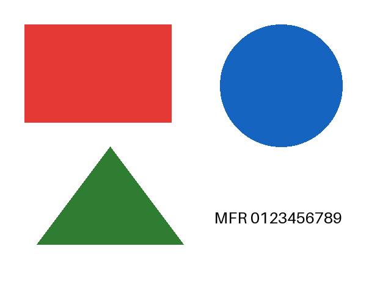

# ファイルプレビュー試験データ

[ファイルプレビューのテスト手順](../../テスト手順-ストレージ共通-ファイルプレビュー.ipynb)で使用するダミーデータです。個人情報や外部サービスへの参照を含みません。

| ファイル | 内容 |
| --- | --- |
| preview.txt | UTF-8 の日本語・英数字、3行 |
| preview.png / preview.jpg | 640 × 480。赤い長方形、青い円、緑の三角形、英数字 |
| preview.pdf | 2ページ。日本語、英数字、画像。2ページ目だけに検索語「検索確認」を配置 |
| preview.docx | 明示的な改ページを含む2ページ。各ページに日本語、英数字、画像 |
| preview.pptx | 2スライド。各スライドに日本語、英数字、画像 |
| preview.csv | UTF-8。日本語、整数・負の数、日付文字列の2行 |
| preview.xlsx | 「測定値」「集計」の2シート。日付は文字列ではなく Excel の日付型 |
| preview.webm | VP9、320 × 240、10 fps、12秒、音声なしの動くカラーパターン |

画像の期待結果：

PDF は ReportLab の `UnicodeCIDFont('HeiseiMin-W3')` を使用して作成し、日本語フォントを埋め込んでいません。PDF.js が `UniJIS-UCS2-H` と `Adobe-Japan1-UCS2` の CMap を読み込むため、日本語 CMap 配信の不具合を確認できます。DOCX/PPTX の日本語フォントは変換サービス側で解決されます。

XLSX の日付型は MFR で `2026-01-02T00:00:00` のように表示されます。CSV の日付文字列は `2026-01-02` のままです。値と操作ごとの期待結果は Notebook を参照してください。
